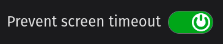
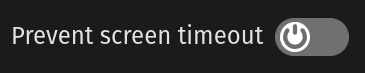
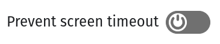
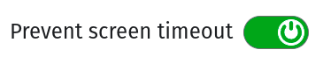

# react-wake-lock-toggle ☀️

A toggle slider React component that utilises the [Wake Lock API](https://developer.mozilla.org/en-US/docs/Web/API/Wake_Lock_API) to prevent the screen from dimming or locking. This can be useful for applications where continuous screen visibility is
important, such as presentations, reading interfaces, or interactive displays.







## Installation

You can install `react-wake-lock-toggle` using npm:

```bash
npm install react-wake-lock-toggle
```

## Usage

Import the WakeLock component into your React application and use it like any other component, for example:

```jsx
import React from "react";
import WakeLockToggle from "react-wake-lock-toggle";

function App() {
  return (
    <div>
      <h1>My Awesome Application</h1>
      <WakeLockToggle label="Prevent screen timeout" />
    </div>
  );
}

export default App;
```

### Customisation

This component is preconfigured and takes an opinionated stance on styling and behaviour. If you require further control and
customisation, please check out alternatives like [react-screen-wake-lock](https://www.npmjs.com/package/react-screen-wake-lock).

#### Label and control ordering

The default behaviour follows conventions, but if you would prefer the label text to be placed after the control, add the following CSS rule:

```css
#wake-lock-label {
  flex-direction: row-reverse;
}
```

#### Internationalisation

Set the required label text via the `label` prop according to preference or the user's locale.

The component respects left-to-right (LTR) and right-to-left (RTL, e.g. Arabic, Hebrew) ordering for different languages.
For example, using the [`dir` global attribute](https://developer.mozilla.org/en-US/docs/Web/HTML/Reference/Global_attributes/dir):

```jsx
<div dir="rtl">
  <WakeLockToggle label="اسکرین آن رکھیں" />
</div>
```


## Browser support

The Wake Lock API is a relatively new feature and may not be supported by older browsers. If the feature is not supported, the
component will not render. You can check the current browser compatibility on [Caniuse.com](https://caniuse.com/mdn-api_wakelock).

## License

ISC (see [LICENSE](./LICENSE)).